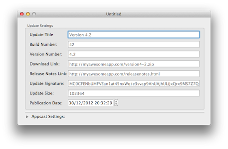
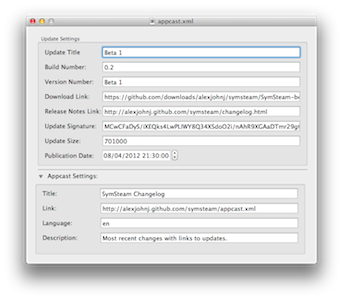

    

	

	    
	

	

		
	

	<h1> Download Appcastr <a href="https://github.com/downloads/alexjohnj/appcastr/Appcastr-0.1.1.zip">{{ page.version }}</a> or <a href="https://github.com/alexjohnj/appcastr"> View the Project on GitHub</a></h1>

---

## What is Appcastr?

Appcastr is a tool for Mac developers that helps simplify the process of publishing updates using the Sparkle update system. To publish an update using Sparkle you need to write an appcast file that is, essentially, an RSS feed. Writing this isn't difficult but it isn't fun either and it could be easier. That's where Appcastr comes in. Appcastr provides a nice GUI that lets you enter in the necessary information for your appcast feed and then spits out an appcast file that you can put on your server. 

## What can Appcastr Currently do?

Version 0.1.1 of Appcastr supports editing the following attributes of an appcast file:

- The update's title, build number, version number, download link, release notes link, signature, update size and publication date.
- The appcast file's title, link, language and description.

Appcastr also has support for autosave and versions on OS X Lion and above. 

Version 0.2[^1] of Appcastr, which can be compiled by checking out the `version-0.2` branch, adds support for editing and adding multiple updates to one appcast file. It also supports specifying a minimum and maximum supported operating system for an update. 

## Is it Still Actively Developed?

Meeeh, not really. I don't want to call the project dead but I haven't done any work on it in quite some time and, while I still have quite a few ideas for features to add that would make Appcastr super awesome, I just haven't got the time to add them. I would like to do more work on it and maybe some weekend I might “finish” 0.2 but I can't make any guarantees. 

## Is it Open Source?

Yup, you can find the source code [on GitHub][github-project-page] and it's released under a do whatever you like license just leave credit where it's due. Like I said above, I don't really have the time to work on it anymore but should someone create a pull request, I'll definitely look at it and merge it if it's appropriate.  

## Useful Links

- [Changelog][changelog]
- [GitHub Project Page][github-project-page]

[^1]: Version 0.2 still isn't complete. It's got quite a few UI bugs and several features haven't been fully implemented.

[changelog]: http://alexjohnj.github.com/appcastr/changelog.html
[github-project-page]: https://github.com/alexjohnj/appcastr
[application-download-link]: https://github.com/downloads/alexjohnj/appcastr/Appcastr-0.1.1.zip
