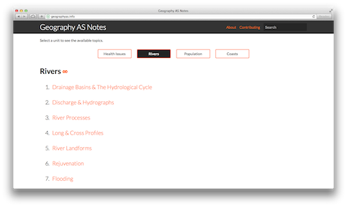
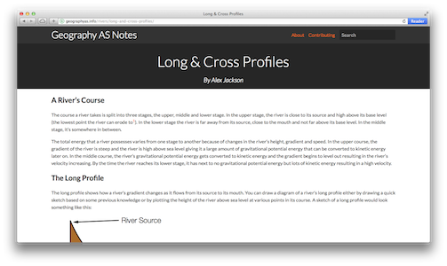

	

	

		
	

	

		
	

	

		
	

	<h1><a href="http://geographyas.info">Visit Geography AS Notes</a> or <a href="https://github.com/alexjohnj/geographyas
"> Check out the Code on GitHub</a></h1>

---

## What is Geography AS Notes?

Geography AS Notes is a revision website for students studying the AQA Geography AS Level in the UK. More specifically, Geography AS Notes is a backup of my notes, with some extra information added, made publicly available.

## Is it Actively Maintained?

Not really. While I continue to fix mistakes on the website and make sure that the website itself works I'm no longer doing the AS Geography course and I have a **lot** less free time now[^1] so no new content is being written.

## How Strictly Does it Follow the AQA Geography Specification?

Of the four topics covered by the website, they're around 95% complete according to the specification. I want to add the missing sections to these topics but I really don't have the time to write them which brings me nicely to the next question.

## Is it Open Source?

As per usual, yes. The website's source code is available on [GitHub][geographyas-notes-github], indeed, the website is hosted on GitHub. While nobody's done it yet, I'll happily accept any additional content that somebody writes and add it to the website[^2] while giving them full credit for what they wrote. 

[geographyas-notes]: http://geographyas.info/
[geographyas-notes-github]: https://github.com/alexjohnj/geographyas

[^1]: The Geography A2 is a killer along with Physics and Maths plus university applications. 
[^2]: Obviously this content has to be reliable. 