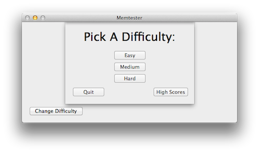

	

	

		
	

	

		
	

	

		
	

	<h1><a href="https://github.com/alexjohnj/memtester-mac/downloads">Download Memtester {{ page.version }}</a> or <a href="https://github.com/alexjohnj/memtester-mac">View it on GitHub</a></h1>

---

## What is Memtester?

Memtester is a native OS X port of a game of the same name that was written in Java. Memtester is a very basic game that tests your ability to remember a series of numbers, letters or other characters depending on the difficulty. It starts off fairly easy but can get hard quickly. 

## Where is the Original Project?

The original Memtester, written by a friend of mine in Java, Can be found on [Google Code][memtester-google-code]. There is both a desktop and Android version available. 

## Useful Links

- [GitHub Page][github-project-page]
- [Changelog][memtester-changelog]
- [Java Version's Google Code Page][memtester-google-code]

[application-download-link]: https://github.com/alexjohnj/memtester-mac/downloads
[github-project-page]: https://github.com/alexjohnj/memtester-mac
[memtester-google-code]: https://code.google.com/p/mem-tester/
[memtester-changelog]: http://alexjohnj.github.com/memtester-mac/changelog.html
