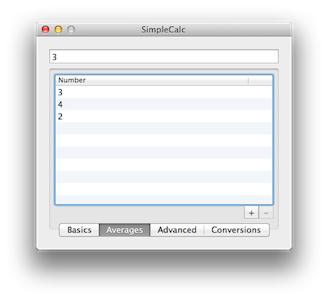
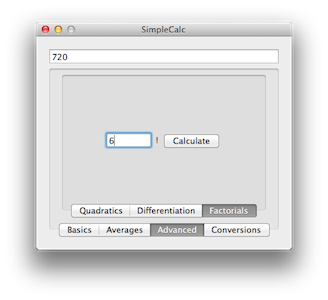

	

		

	

	

		
	

	

		
	

	

		
	

## [View SimpleCalc on GitHub][simplecalc-github]

---

## What is SimpleCalc?

SimpleCalc is a simple calculator for OS X that uses forms instead of buttons to input numbers. It's a very basic application that is only here since it's the first application I ever wrote. SimpleCalc can do a very small number of things including:

- Addition, subtraction, multiplication & division.
- Finding the square and root of a number. 
- Finding the mean of a set of numbers.
- Solving a quadratic equation.
- Finding the factorial of a number.
- Converting between quite a few different units.

## What Languages is SimpleCalc Available in?

SimpleCalc is available in English, Spanish and Italian. The Spanish translation is probably pretty poor since Spanish isn't my first language but the Italian translation is (I assume) very good since it was translated by a native speaker, Pierpaolo Caricato. 

## Is SimpleCalc Open Source?

Yup. You can find the source code on [GitHub][simplecalc-github] and there's also a GoogleCode page floating around on the internet somewhere. Feel free to fork the project but don't bother making any pull requests since SimpleCalc is no longer actively worked on. 

## Credits

- Icon By James Quirk.
- Italian Translation by Pierpaolo Caricato.

[simplecalc-github]: https://github.com/alexjohnj/SimpleCalc